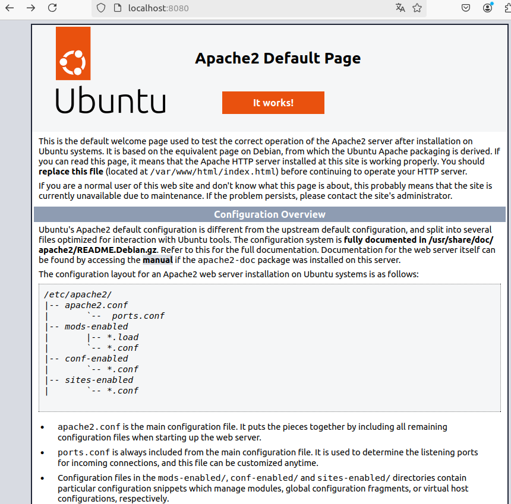
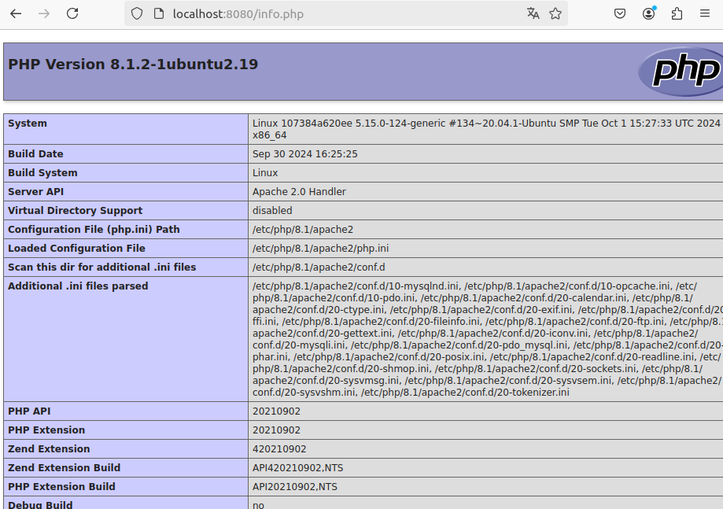
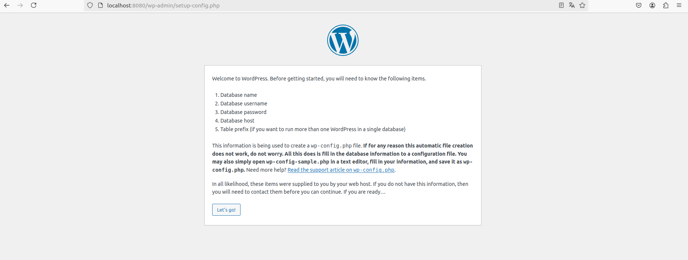
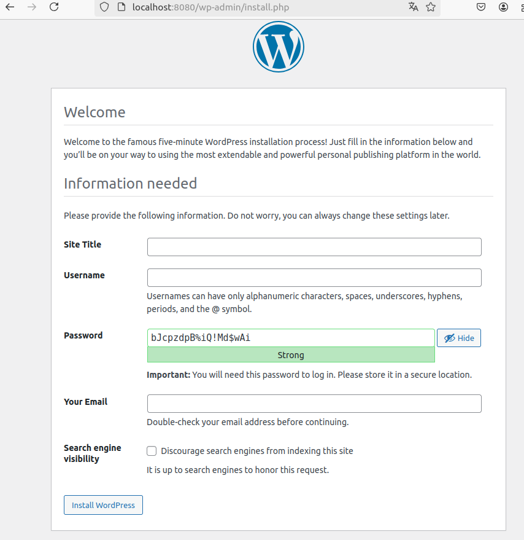
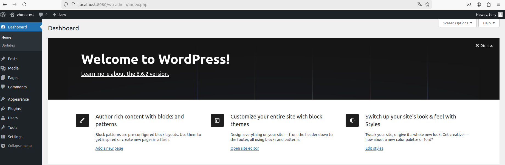

<div  style="text-align: center">
  
# DOCKER 04 - LAMP

</div>

<br>

<div  style="text-align: center">


## 1. Utiliza la imagen de Ubuntu , tag 22 y apoyandote en esta guía sigue sus instrucciones para instalar LAMP en dicho contenedor.

</div>

    
    Con este comando descargamos la imagen de ubuntu 22.04:

    sudo docker pull ubuntu:22.04

    Con este comando creamos el contenedor dam_lamp con la imagen de arriba y añadimos los puertos

    sudo docker container create -i -t -p 8080:80 --name dam_lamp ubuntu:22.04    

    Con este comando arrancamos el contenedor y entramos en el:

    info: --attach: adjunta la salida estandar y de error del contenedor al terminal actual, permitiendo ver la salida del contenedor en tiempo real.

    info: -i: mantiene la entrada estandar abierta, lo que permite interactuar con el contenedor.

    sudo docker container start --attach -i dam_lamp

    Con este comando instalamos los paquetes necesarios para LAMP, todo dentro del contenedor:

    apt update

    apt install -y apache2 apache2-utils

    apt isntall -y mariadb-server mariadb-client

    service mariadb start

    mysql_secure_installation
<details >  
    root@107384a620ee:/# mysql_secure_installation

NOTE: RUNNING ALL PARTS OF THIS SCRIPT IS RECOMMENDED FOR ALL MariaDB
SERVERS IN PRODUCTION USE!  PLEASE READ EACH STEP CAREFULLY!

In order to log into MariaDB to secure it, we'll need the current
password for the root user. If you've just installed MariaDB, and
haven't set the root password yet, you should just press enter here.

Enter current password for root (enter for none):
OK, successfully used password, moving on...

Setting the root password or using the unix_socket ensures that nobody
can log into the MariaDB root user without the proper authorisation.

You already have your root account protected, so you can safely answer 'n'.

Switch to unix_socket authentication [Y/n] n
... skipping.

You already have your root account protected, so you can safely answer 'n'.

Change the root password? [Y/n] y
New password:
Re-enter new password:
Sorry, you can't use an empty password here.

New password:
Re-enter new password:
Sorry, you can't use an empty password here.

New password:
Re-enter new password:
Sorry, you can't use an empty password here.

New password:
Re-enter new password:
Password updated successfully!
Reloading privilege tables..
... Success!


By default, a MariaDB installation has an anonymous user, allowing anyone
to log into MariaDB without having to have a user account created for
them.  This is intended only for testing, and to make the installation
go a bit smoother.  You should remove them before moving into a
production environment.

Remove anonymous users? [Y/n] y
... Success!

Normally, root should only be allowed to connect from 'localhost'.  This
ensures that someone cannot guess at the root password from the network.

Disallow root login remotely? [Y/n] y
... Success!

By default, MariaDB comes with a database named 'test' that anyone can
access.  This is also intended only for testing, and should be removed
before moving into a production environment.

Remove test database and access to it? [Y/n] y
- Dropping test database...
  ... Success!
- Removing privileges on test database...
  ... Success!

Reloading the privilege tables will ensure that all changes made so far
will take effect immediately.

Reload privilege tables now? [Y/n] y
... Success!

Cleaning up...

All done!  If you've completed all of the above steps, your MariaDB
installation should now be secure.

Thanks for using MariaDB!
</details>

    apt install -y php php-mysql libapache2-mod-php
    
    echo "<?php phpinfo(); ?>" | sudo tee /var/www/html/info.php

    service apache2 start    

    Esto desde el navegador:

    http://localhost:8080
    http://localhost:8080/info.php
  




<br>

<div  style="text-align: center">

## 2. Utiliza esta guía para instalar wordpress en el contenedor.

</div>
    Dentro del contenedor que creamos en el primer punto, seguimos con estos pasos:

    apt install ghostscript 

    apt install libapache2-mod-php

    apt install mysql-server

    apt install php

    apt install php-bcmath

    apt install php-curl
  
    apt install php-imagick  

    apt install php-intl

    apt install php-json

    apt install php-mbstring

    apt install php-mysql

    apt install php-xml

    apt install php-zip
 
    Ahora creamos la instalacion para el directorio:

    mkdir -p /srv/www

    chown www-data: /srv/www

    curl https://wordpress.org/latest.tar.gz | tar zx -C /srv/www
<details>

root@107384a620ee:/# curl https://wordpress.org/latest.tar.gz | tar zx -C /srv/www

| % Total | % Received | % Xferd | Average Speed | Time | Time | Time | Current |
|---------|------------|---------|---------------|------|------|------|---------|
|         |            |         |               | Dload| Upload| Total| Spent   | Left | Speed |
| 100 23.4M | 100 23.4M | 0 | 6372k | 0:00:03 | 0:00:03 | --:--:-- | 6370k |

</details>
  
    Ahora usamos echo para crear el archivo /etc/apache2/sites-available/wordpress.conf
    y redirigimos la configuracion a este archivo

    cat <<EOF > /etc/apache2/sites-available/wordpress.conf

    Dentro de este archivo añadimos lo siguiente:

<details>

    <VirtualHost *:80>
      DocumentRoot /srv/www/wordpress
      <Directory /srv/www/wordpress>
          Options FollowSymLinks
          AllowOverride Limit Options FileInfo
          DirectoryIndex index.php
          Require all granted
      </Directory>
      <Directory /srv/www/wordpress/wp-content>
          Options FollowSymLinks
          Require all granted
      </Directory>
    </VirtualHost>
    EOF

</details>

    Ahora habilitamos wordpress, pero antes tenemos que reiniciar apache2

    service apache2 reload

    Ahora habilitamos el sitio de wordpress

    a2ensite wordpress

    a2enmod rewrite

    Ahora tenemos que reiniciar de nuevo apache2

    service apache2 restart

    a2dissite 000-default

    Por ultimo reiciamos apache2 de nuevo

    service apache2 reload

<details>

root@107384a620ee:/# service apache2 reload
* Reloading Apache httpd web server apache2                                                          *
* Apache2 is not running
  root@107384a620ee:/# a2ensite wordpress
  Enabling site wordpress.
  To activate the new configuration, you need to run:
  service apache2 reload
  root@107384a620ee:/# service apache2 start
* Starting Apache httpd web server apache2                                                          AH00558: apache2: Could not reliably determine the server's fully qualified domain name, using 172.17.0.2. Set the 'ServerName' directive globally to suppress this message
*
root@107384a620ee:/# service apache2 reload
* Reloading Apache httpd web server apache2                                                          *
  root@107384a620ee:/# a2ensite wordpress
  Site wordpress already enabled
  root@107384a620ee:/# a2enmod rewrite
  Enabling module rewrite.
  To activate the new configuration, you need to run:
  service apache2 restart
  root@107384a620ee:/# service apache2 restart
* Restarting Apache httpd web server apache2                                                        AH00558: apache2: Could not reliably determine the server's fully qualified domain name, using 172.17.0.2. Set the 'ServerName' directive globally to suppress this message
  [ OK ]
  root@107384a620ee:/# a2dissite 000-default
  Site 000-default disabled.
  To activate the new configuration, you need to run:
  service apache2 reload
  root@107384a620ee:/# service apache2 reload
* Reloading Apache httpd web server apache2                                                          *
  root@107384a620ee:/#

</details>

    Ahora tenemos que configurar la base de datos para wordpress

    Por un error tuve que volver a instalar mariadb : apt isntall -y mariadb-server mariadb-client

    mysql -u root

    CREATE DATABASE wordpress;

    CREATE USER 'anxo' IDENTIFIED BY '1234';

    GRANT SELECT, INSERT, UPDATE, DELETE, CREATE, DROP, ALTER ON wordpress.* TO 'anxo';
    
    FLUSH PRIVILEGES;
    
    QUIT;

    Ahora creamos el archivo de configuracion de wordpress

    touch /srv/www/wordpress/wp-config.php
  
    Tenemos que instalar el nano:

    apt install nano

    nano /srv/www/wordpress/wp-config.php

    Dentro de este archivo añadimos lo siguiente:

<details>

```php

  <?php
  /**
   * The base configuration for WordPress
     *
     * The wp-config.php creation script uses this file during the installation.
     * You don't have to use the website, you can copy this file to "wp-config.php"
     * and fill in the values.
     *
     * This file contains the following configurations:
     *
  * * Database settings
  * * Secret keys
  * * Database table prefix
  * * ABSPATH
   *
     * @link https://developer.wordpress.org/advanced-administration/wordpress/wp-config/
     *
     * @package WordPress
     */
  
  // ** Database settings - You can get this info from your web host ** //
  /** The name of the database for WordPress */
  define( 'DB_NAME', 'wordpress' );
  
  /** Database username */
  define( 'DB_USER', 'anxo' );
  
  /** Database password */
  define( 'DB_PASSWORD', '1234' );
  
  /** Database hostname */
  define( 'DB_HOST', 'localhost' );
  
  /** Database charset to use in creating database tables. */
  define( 'DB_CHARSET', 'utf8mb4' );
  
  /** The database collate type. Don't change this if in doubt. */
  define( 'DB_COLLATE', '' );
  
  /**#@+
  * Authentication unique keys and salts.
   *
   * Change these to different unique phrases! You can generate these using
   * the {@link https://api.wordpress.org/secret-key/1.1/salt/ WordPress.org secret-key service}.
   *
   * You can change these at any point in time to invalidate all existing cookies.
   * This will force all users to have to log in again.
   *
   * @since 2.6.0
   */
  define( 'AUTH_KEY',         's[u1wXGyctU,mlo?e]@9oF8H5 2TvN{cXIW$Bka$2y1mHiewl^#wbs?5^w}bqiZV' );
  define( 'SECURE_AUTH_KEY',  '%c|p_{W18!)`0Z-;$o[0_Gw!>FcjP,lRJXi/M1[?#>o0:p[@su$]P=DIR}$BqjG(' );
  define( 'LOGGED_IN_KEY',    'G.ui.lm42ILdmyeWLg)~:rO,6o`gkUeDKq9]$7x$snYHW6!I0>A3cRK~!x ]` z<' );
  define( 'NONCE_KEY',        '[xUHnT-um:]H;X._l7p_#J!T3M`Iy]Od%%.*ImS~2_Z{?s)2t). 6GQie0,;Y!n4' );
  define( 'AUTH_SALT',        '_p7zJt7xK1O6Ap{&J,a#2{eFlCLKi*ZMw3A!1bR#WT?@srOmM$e);X<+ia]<`b?a' );
  define( 'SECURE_AUTH_SALT', '%3{{P[$)R5dLwk=uE3NcPo]`;f`ND5oO!@E.cc9`.X/Qgz719lt.0uP:UuB56CKu' );
  define( 'LOGGED_IN_SALT',   '8x&Xtei=>P#7NI@f,yGOS7-9V}LMKS/-X^UiVLzKlV8GQBv8%I[#f7^nP^~N/7N3' );
  define( 'NONCE_SALT',       'OLK3Lg|^p|&<p~{{B8@g%t/a}wXpV(R(HETQ7Y1o}YiW&@[a#%4Gs1|b*j?RoZ1.' );
  
  /**#@-*/
  
  /**
  * WordPress database table prefix.
   *
   * You can have multiple installations in one database if you give each
   * a unique prefix. Only numbers, letters, and underscores please!
   */
  $table_prefix = 'wp_';
  
  /**
  * For developers: WordPress debugging mode.
   *
   * Change this to true to enable the display of notices during development.
   * It is strongly recommended that plugin and theme developers use WP_DEBUG
   * in their development environments.
   *
   * For information on other constants that can be used for debugging,
   * visit the documentation.
   *
   * @link https://developer.wordpress.org/advanced-administration/debug/debug-wordpress/
   */
  define( 'WP_DEBUG', false );
  
  /* Add any custom values between this line and the "stop editing" line. */
  
  
  
  /* That's all, stop editing! Happy publishing. */
  
  /** Absolute path to the WordPress directory. */
  if ( ! defined( 'ABSPATH' ) ) {
    define( 'ABSPATH', __DIR__ . '/' );
  }
  
  /** Sets up WordPress vars and included files. */
  require_once ABSPATH . 'wp-settings.php';

```
</details>

<br>

<div  style="text-align: center">

## 3. Comprueba que puedes acceder a wordpress. 

</div>
    Desde el navegador:

    http://localhost:8080/wp-admin/setup-config.php



    Por ultimo entramos en wordpress:



